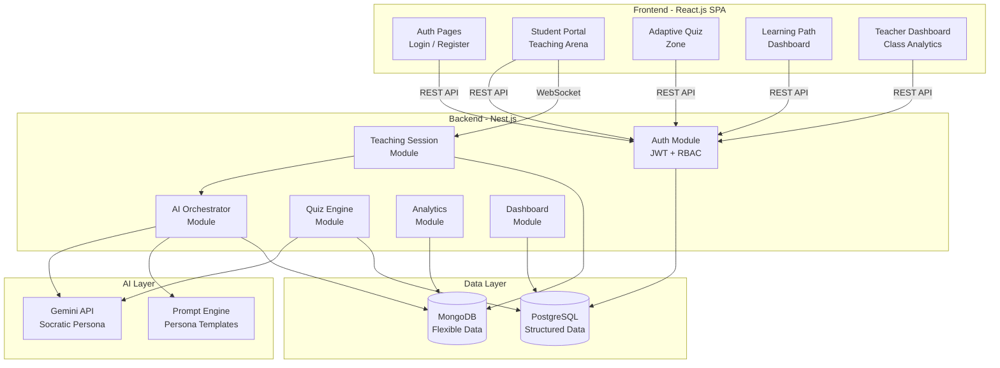

# 🚀 INNOVATION & ARCHITECTURE — Phase 2

## Hackathon Giáo Dục HCMUT 2026

> **Tên sản phẩm được chọn:** **BrainLift** — Học qua Dạy  
> **Triết lý:** Đảo ngược vai trò — học sinh DẠY cho AI, không phải hỏi AI

---

## 1. Bộ lọc "Anti-Cliché" — 3 ý tưởng tầm thường cần loại bỏ

> [!CAUTION]
> 80% đội thi sẽ rơi vào 3 bẫy dưới đây. Chúng ta **tuyệt đối tránh**.

### ❌ Cliché #1: AI Chatbot Gia sư

**Mô tả:** Wrapper ChatGPT/Gemini cho phép học sinh hỏi đáp về môn học.

**Tại sao loại:**
- Chỉ là iframe/API call đến LLM có sẵn — **không có giá trị kỹ thuật**
- Trực tiếp **vi phạm tinh thần đề bài** ("không trả lời thẳng")
- BGK đã nhìn thấy hàng trăm chatbot wrapper → **zero wow factor**
- Không tận dụng được hybrid database — MongoDB và PostgreSQL đều dư thừa

### ❌ Cliché #2: PDF/Tài liệu → Quiz Generator

**Mô tả:** Upload tài liệu, AI tự tạo câu hỏi trắc nghiệm.

**Tại sao loại:**
- Là tính năng có sẵn trong Quizlet, Kahoot, NotebookLM — **không mới**
- Học sinh vẫn **thụ động** — chỉ đọc và chọn đáp án
- Không giải quyết "brainrot" — chỉ thay đổi hình thức tiêu thụ nội dung
- Hybrid DB không cần thiết — một MongoDB là đủ

### ❌ Cliché #3: AI Tóm tắt + Flashcard Maker

**Mô tả:** AI tóm tắt bài giảng thành bullet points hoặc flashcard.

**Tại sao loại:**
- Lại khiến học sinh **phụ thuộc AI hơn** — não bộ không cần xử lý thông tin
- Làm trầm trọng thêm brainrot thay vì giải quyết
- Sản phẩm quá đơn giản — không thể hiện kiến trúc phức tạp (mất 20 điểm kiến trúc)
- Không có adaptive component — điểm "Tính năng AI" sẽ rất thấp

---

## 2. Deep Innovation — 2 ý tưởng đột phá

### 💡 Ý tưởng A: **"BrainLift" — Học qua Dạy (Learn-by-Teaching)**

#### Insight cốt lõi

Dựa trên **Hiệu ứng Protégé** (Protégé Effect) — nghiên cứu giáo dục đã chứng minh: *khi bạn dạy người khác, bạn học sâu hơn gấp 2-3 lần so với khi bạn chỉ nghe giảng*.

#### Cơ chế hoạt động

**AI không đóng vai thầy giáo — AI đóng vai "học sinh yếu".**

Học sinh phải **DẠY** cho AI hiểu một khái niệm. AI cố tình:
- Hiểu sai theo cách hợp lý (misconceptions thường gặp)
- Đặt câu hỏi ngây ngô nhưng sâu sắc
- Yêu cầu giải thích lại bằng cách khác

```
Ví dụ tương tác:

Học sinh: "Quang hợp là quá trình cây xanh tạo thức ăn từ ánh sáng"
AI (vai học sinh yếu): "Vậy nếu em để cây trong phòng tối 
                        nhưng cho ăn phân bón thì sao? Phân bón 
                        cũng là thức ăn mà?"
Học sinh: [phải suy nghĩ sâu hơn để giải thích sự khác biệt 
           giữa dinh dưỡng khoáng và quang hợp]
```

#### Tại sao đáp ứng HOÀN HẢO 4 chức năng bắt buộc?

| Chức năng bắt buộc | Cách BrainLift triển khai |
|---------------------|---------------------------|
| **AI hỏi ngược** | ✅ BẢN CHẤT — AI luôn hỏi vì đóng vai học sinh cần được dạy |
| **Lộ trình cá nhân** | ✅ Dựa trên chủ đề nào HS dạy tốt/kém → tạo roadmap ôn tập |
| **Adaptive Quiz** | ✅ "Bài kiểm tra dạy" — AI tăng/giảm độ "ngoan" theo mastery |
| **Dashboard GV** | ✅ GV thấy: HS nào dạy được AI, HS nào bị AI "hỏi thua" |

#### Tại sao CẦN hybrid database?

- **PostgreSQL:** Users, courses, mastery scores, enrollments, quiz results — dữ liệu quan hệ, cần ACID
- **MongoDB:** AI conversation trees (deeply nested), AI persona states (dynamic schema), learning profiles (evolving), teaching session logs (variable-length documents)

---

### 💡 Ý tưởng B: **"ThinkTrace" — Bản đồ Tư duy Pháp y (Cognitive Forensics)**

#### Insight cốt lõi

Giáo viên hiện tại chỉ thấy **KẾT QUẢ** (đúng/sai). Nhưng brainrot xảy ra trong **QUÁ TRÌNH** suy nghĩ. ThinkTrace bắt học sinh **vẽ bản đồ tư duy** (thought map) trước khi AI hỗ trợ.

#### Cơ chế hoạt động

1. Học sinh gặp bài tập → phải tạo "Thought Map" trước (kéo-thả các node: "Tôi biết gì", "Tôi đã thử gì", "Tôi kẹt ở đâu")
2. AI phân tích Thought Map → xác định lỗ hổng tư duy → gợi ý hướng đi (không đáp án)
3. GV nhận được "Cognitive Report" — thấy QUÁ TRÌNH suy nghĩ của từng HS

#### Hybrid DB fit

- **PostgreSQL:** Users, assignments, scores, class structures
- **MongoDB:** Thought map graphs (deeply nested tree/graph), AI analysis documents, cognitive profiles

#### Hạn chế

- UX phức tạp hơn — vẽ thought map cần thời gian design UI
- Khó demo ấn tượng trong 5 phút — không có "conversation feel" hấp dẫn
- Rủi ro cao về thời gian phát triển drag-and-drop UI

---

## 3. Lựa chọn & Lý do: BrainLift 🏆

> [!IMPORTANT]
> **Chọn BrainLift** vì 4 lý do chiến lược:

| Tiêu chí | BrainLift | ThinkTrace |
|----------|-----------|------------|
| **Wow factor khi demo** | 🟢 Rất cao — cuộc hội thoại AI đảo vai cực kỳ ấn tượng | 🟡 Trung bình — drag-drop UI khó gây bất ngờ |
| **Khả thi trong 5 giờ** | 🟢 Chat interface + API call — nhẹ, nhanh | 🔴 Canvas/drag-drop phức tạp |
| **Giải quyết brainrot** | 🟢 Trực tiếp — không thể "lười" khi phải DẠY | 🟡 Gián tiếp — vẫn phụ thuộc tự giác vẽ map |
| **Hybrid DB necessity** | 🟢 Tự nhiên — conversation logs + persona states | 🟡 Hợp lý nhưng ít thuyết phục hơn |

---

## 4. Kiến trúc hệ thống BrainLift

### 4.1 Sơ đồ tổng quan



### 4.2 Luồng tương tác chính

```
┌─────────────────────────────────────────────────────────────┐
│                    LUỒNG "DẠY CHO AI"                       │
├─────────────────────────────────────────────────────────────┤
│                                                             │
│  1. HS chọn chủ đề muốn ôn tập (VD: "Quang hợp")          │
│              ↓                                              │
│  2. AI nhận vai "học sinh yếu" với persona phù hợp          │
│              ↓                                              │
│  3. HS bắt đầu giảng bài cho AI                            │
│              ↓                                              │
│  4. AI đặt câu hỏi dựa trên misconceptions phổ biến        │
│     ┌── HS trả lời tốt → AI "hiểu" → tăng độ khó câu hỏi  │
│     └── HS bối rối → AI gợi ý hướng suy nghĩ (không đáp án)│
│              ↓                                              │
│  5. Kết thúc phiên → AI đánh giá "Teaching Score"           │
│              ↓                                              │
│  6. Hệ thống cập nhật mastery level + learning path         │
│              ↓                                              │
│  7. GV nhận report trên Dashboard                           │
│                                                             │
└─────────────────────────────────────────────────────────────┘
```

### 4.3 Phân tách Database chi tiết

#### PostgreSQL — Source of Truth

```sql
-- Bảng Users
users (id, email, password_hash, role, full_name, created_at)

-- Bảng Courses
courses (id, name, subject, description, teacher_id)

-- Bảng Enrollments  
enrollments (id, student_id, course_id, enrolled_at)

-- Bảng Quiz Results
quiz_results (id, student_id, course_id, topic, score, 
              difficulty_level, completed_at)

-- Bảng Mastery Scores
mastery_scores (id, student_id, topic_id, mastery_level, 
                teaching_score, last_updated)
```

#### MongoDB — Dynamic & AI Data

```javascript
// Collection: teaching_sessions
{
  _id: ObjectId,
  studentId: "pg_user_id",        // FK to PostgreSQL
  courseId: "pg_course_id",
  topic: "Quang hợp",
  aiPersona: {
    confusionLevel: 0.7,          // Mức "ngây ngô" của AI
    currentMisconceptions: [...],
    adaptedQuestions: [...]
  },
  conversation: [                  // Biến đổi, nested sâu
    { role: "student", content: "...", timestamp: ... },
    { role: "ai_learner", content: "...", timestamp: ...,
      cognitiveIntent: "probe_deeper" }
  ],
  teachingScore: 78,
  cognitiveInsights: {
    strongPoints: ["definition", "process"],
    weakPoints: ["application", "edge_cases"],
    thinkingPatterns: [...]
  },
  createdAt: ISODate, duration: 840
}

// Collection: learning_profiles
{
  _id: ObjectId,
  studentId: "pg_user_id",
  learningStyle: "visual",        // Có thể thay đổi
  topicMastery: {                 // Dynamic keys
    "quang_hop": { level: 0.8, teachCount: 3, ... },
    "ho_hap":   { level: 0.4, teachCount: 1, ... }
  },
  personalGoals: [...],
  recommendedPath: { nodes: [...], edges: [...] }
}

// Collection: quiz_content
{
  _id: ObjectId,
  topic: "Quang hợp",
  difficulty: 3,
  type: "multiple_choice",        // Hoặc "explain", "diagram"...
  question: "...",
  options: [...],                 // Schema khác nhau tuỳ type
  correctAnswer: "...",
  misconceptionTargeted: "light_is_food"
}

// Collection: analytics_events
{
  studentId: "pg_user_id",
  event: "teaching_session_complete",
  metadata: { topic: "...", duration: 840, ... },
  timestamp: ISODate
}
```

### 4.4 Tại sao hybrid là BẮT BUỘC (không phải tuỳ chọn)

```
┌──────────────────────────────────────────────────────────┐
│              PHÂN TÁCH THEO BẢN CHẤT DỮ LIỆU            │
├────────────────────────┬─────────────────────────────────┤
│     PostgreSQL         │         MongoDB                 │
├────────────────────────┼─────────────────────────────────┤
│ Schema CỐ ĐỊNH         │ Schema BIẾN ĐỘNG               │
│ "Ai là ai, học gì"    │ "Nghĩ gì, nói gì, tiến bộ sao" │
│ ACID transactions      │ Eventual consistency OK         │
│ JOIN nhiều bảng        │ Embedded documents              │
│ Aggregate reporting    │ Append-heavy writes             │
│ Ít thay đổi cấu trúc  │ Mỗi HS có schema riêng         │
└────────────────────────┴─────────────────────────────────┘
```

---

## 5. Work Breakdown Structure (WBS)

### Epic 0: Project Setup (Sprint 0)

| Task | Mô tả | Owner |
|------|--------|-------|
| E0-1 | Init monorepo: `/frontend` (Vite + React) + `/backend` (Nest.js) | Dev 1 |
| E0-2 | Setup PostgreSQL local + Prisma/TypeORM | Dev 2 |
| E0-3 | Setup MongoDB local + Mongoose | Dev 2 |
| E0-4 | Cấu hình env, CORS, cấu trúc thư mục | Dev 1 |

---

### Epic 1: Authentication & User Management

| Task | Layer | Mô tả |
|------|-------|--------|
| E1-1 | **Backend** | Auth module: JWT strategy, login/register endpoints |
| E1-2 | **Backend** | User module: CRUD, role-based guards (student/teacher) |
| E1-3 | **Database** | PostgreSQL: `users` table với role enum |
| E1-4 | **Frontend** | Login/Register pages, role selection UI |
| E1-5 | **Frontend** | Auth context, protected routes, token management |

---

### Epic 2: Teaching Arena (Core Feature — AI "Hỏi ngược") ⭐

| Task | Layer | Mô tả |
|------|-------|--------|
| E2-1 | **Backend** | Teaching Session module: create/get/end session endpoints |
| E2-2 | **Backend** | AI Orchestrator: Gemini API integration + Socratic persona prompt |
| E2-3 | **Backend** | Prompt Engine: template cho "confused student" persona với context chủ đề |
| E2-4 | **Database** | MongoDB: `teaching_sessions` collection + schema |
| E2-5 | **Frontend** | Chat UI component: real-time conversation interface |
| E2-6 | **Frontend** | Topic selector + session management UI |
| E2-7 | **Backend** | Teaching Score calculator: đánh giá chất lượng "dạy" của HS |

---

### Epic 3: Adaptive Quiz Engine

| Task | Layer | Mô tả |
|------|-------|--------|
| E3-1 | **Backend** | Quiz module: generate quiz, submit answers, calculate adaptive difficulty |
| E3-2 | **Backend** | AI Quiz Generator: tạo câu hỏi dựa trên weak points từ teaching sessions |
| E3-3 | **Database** | MongoDB: `quiz_content` seed data + dynamic questions |
| E3-4 | **Database** | PostgreSQL: `quiz_results` table cho scoring/reporting |
| E3-5 | **Frontend** | Quiz UI: hiển thị câu hỏi, timer, submit, kết quả |
| E3-6 | **Frontend** | Quiz review: hiển thị điểm yếu + đề xuất ôn tập |

---

### Epic 4: Learning Path & Profile

| Task | Layer | Mô tả |
|------|-------|--------|
| E4-1 | **Backend** | Learning Profile module: tổng hợp data từ teaching + quiz |
| E4-2 | **Backend** | Path Generator: AI đề xuất lộ trình dựa trên mastery levels |
| E4-3 | **Database** | MongoDB: `learning_profiles` collection |
| E4-4 | **Database** | PostgreSQL: `mastery_scores` table |
| E4-5 | **Frontend** | Learning path visualization (progress bars/cards) |

---

### Epic 5: Teacher Dashboard

| Task | Layer | Mô tả |
|------|-------|--------|
| E5-1 | **Backend** | Dashboard module: aggregate stats cho class + individual students |
| E5-2 | **Backend** | Alert engine: detect at-risk students (low teaching scores) |
| E5-3 | **Database** | PostgreSQL queries: JOINs cho enrollment + mastery + quiz data |
| E5-4 | **Database** | MongoDB queries: aggregate teaching session insights |
| E5-5 | **Frontend** | Class overview: bảng thống kê, biểu đồ tiến độ |
| E5-6 | **Frontend** | Student detail view: xem conversation logs, cognitive insights |
| E5-7 | **Frontend** | Alert panel: danh sách HS cần chú ý |

---

### Epic 6: Polish & Demo Prep

| Task | Layer | Mô tả |
|------|-------|--------|
| E6-1 | **All** | Seed data: tạo mock users, courses, teaching sessions |
| E6-2 | **Frontend** | UI polish: animations, responsive, error states |
| E6-3 | **Backend** | Fallback responses: mock AI khi offline |
| E6-4 | **All** | End-to-end testing: chạy toàn bộ happy path |
| E6-5 | **Slides** | Soạn slides thuyết trình + sơ đồ kiến trúc |

---

## 6. Phân bổ ưu tiên MVP

> [!TIP]
> Trong 5 tiếng, tập trung vào **đường chéo vàng** — happy path end-to-end.

```
Ưu tiên 1 (PHẢI có):  Auth → Teaching Arena → Dashboard GV (basic)
Ưu tiên 2 (NÊN có):   Adaptive Quiz → Learning Path
Ưu tiên 3 (CÓ THÌ TỐT): Alert engine, advanced analytics, UI polish
```

| Mức ưu tiên | Epics | Lý do |
|-------------|-------|-------|
| 🔴 **P0 — Must** | E0, E1, E2 | Không có = không có sản phẩm. E2 chiếm 50% điểm |
| 🟠 **P1 — Should** | E3, E5 (basic) | Quiz + Dashboard = đủ 4/4 chức năng bắt buộc |
| 🟡 **P2 — Nice** | E4, E5 (advanced), E6 | Polish, path visualization, alerting |

---

## 7. Chiến lược Prompt Engineering cho AI Persona

### System Prompt cốt lõi (sketch)

```
Vai trò: Bạn là một học sinh đang gặp khó khăn với chủ đề [TOPIC].
Quy tắc:
1. KHÔNG BAO GIỜ đưa ra đáp án đúng
2. Luôn đặt câu hỏi dựa trên misconceptions phổ biến
3. Thể hiện sự "bối rối" có chủ đích để buộc người dạy giải thích rõ hơn  
4. Khi người dạy giải thích tốt → thể hiện "à, hiểu rồi!" và hỏi sâu hơn
5. Khi người dạy giải thích sai → hỏi "nhưng em đọc [fact] thì sao?"
6. Đánh giá chất lượng giảng dạy theo thang: clarity, depth, accuracy
```

Prompt này sẽ được **parameterize** theo:
- `topic` — chủ đề đang học
- `confusionLevel` — mức độ "ngây ngô" (adaptive)
- `knownMisconceptions` — danh sách hiểu lầm phổ biến của chủ đề
- `studentHistory` — HS từng dạy chủ đề này chưa?

---

> *Tài liệu này là Phase 2 của hackathon planning.*
> *Dựa trên `spec.md` + `knowledge-base.md`. Không chứa thông tin bịa đặt.*
> *Phiên bản: 1.0 — 24/04/2026*
